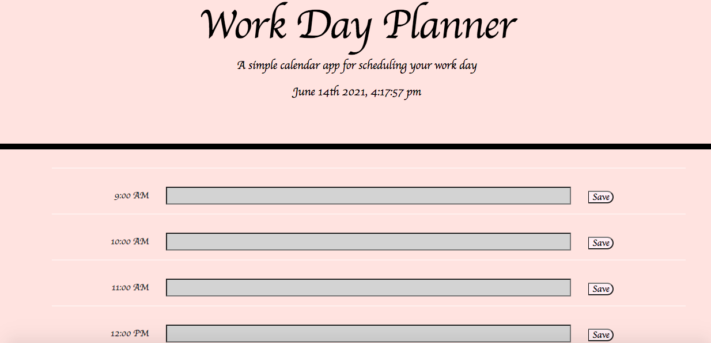

# work_day_scheduler
This is my version of a simple calendar application.  This calendar focuses on the average workday schedule. The application allows the user to save events for each hour and the saved events remain visible after the page is refreshed.  Past events appear with a grey background in the input column, present events appear with a white background, and future events appear with a coral background. The date and time appear through the use of moment.js.  This app runs in the browser and features dynamically updated HTML and CSS that is powered by jQuery.  

screenshot: 

Deployed: https://caseofbase18.github.io/work_day_scheduler/